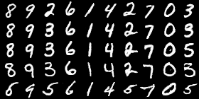
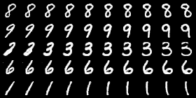

# InfoGAN for Torch

This is an unofficial Torch implementation of the InfoGAN neural network
architecture proposed by Chen et al in their paper ["InfoGAN: Interpretable
Representation Learning by Information Maximizing Generative Adversarial
Nets"](http://arxiv.org/abs/1606.03657). The original TensorFlow implementation
can be found at https://github.com/openai/InfoGAN.





## Features

* [x] Implement the InfoGAN network architecture
* [x] Use variational mutual information maximization for the error calculations
      (as per the paper)
* [x] CLI options for tweaking noise inputs and salient variables
* [x] Deterministic training

## Requirements

* A cuDNN 5 capable NVIDIA graphics card
* [nvidia-docker](https://github.com/NVIDIA/nvidia-docker)

## Running

Begin by cloning this repository.

```sh
git clone https://github.com/anibali/infogan
cd infogan
```

**NOTE:** If you are using a Pascal architecture GPU (CUDA 8.0), you will need
to modify the Dockerfile to build from a CUDA 8.0 base image. Refer to
https://github.com/anibali/infogan/issues/5 for more details. Please make this
change before proceeding.

Build the Docker image which contains Torch and all other required
dependencies.

```sh
nvidia-docker build -t infogan-torch .
```

Download the MNIST dataset.

```sh
nvidia-docker run -it --rm --volume=$PWD:/app infogan-torch sh download_mnist.sh
```

Finally, run the training script.

```sh
nvidia-docker run -it --rm --volume=$PWD:/app infogan-torch th bin/train_infogan.lua
```

Output artifacts will appear in the `out/` directory during training, including
examples of fake images generated by the generator network and serialized copies
of the generator and discriminator networks.
